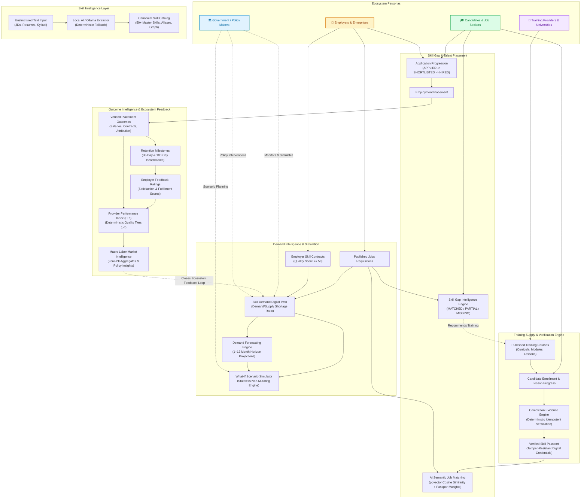
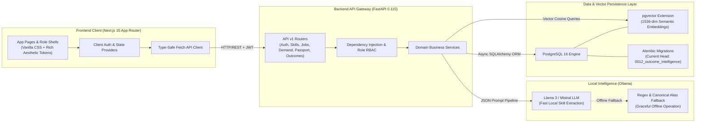

# SkillSync AI — End-to-End System Architecture

## 1. Ecosystem Overview

SkillSync AI connects the four core labor-market stakeholders into a unified, deterministic, closed-loop skill intelligence ecosystem.

---

## 2. Technical Stack & Infrastructure Boundaries

---

## 3. Closed-Loop Architectural Feedback

1. **Demand Signal Ingestion**: Employers publish jobs with required/preferred skills. These immediately feed into the Skill Demand Digital Twin.
2. **Shortage Identification**: The Digital Twin categorizes shortages using the ratio of active job demand to verified candidate supply.
3. **Curriculum Alignment**: Training providers observe demand shortages and publish accredited curricula with matched canonical skills.
4. **Candidate Verification**: Candidates close their identified skill gaps through course completion, generating tamper-proof evidence in their Verified Skill Passport.
5. **Verified Hiring**: Employers match and hire candidates possessing verified skills under binding Skill Contracts.
6. **Performance & Policy Feedback**: 90-day/180-day employment retention and employer ratings update the Provider Performance Index (PPI). Macro employment metrics inform government policy interventions and calibrate ongoing training incentives, closing the loop.
